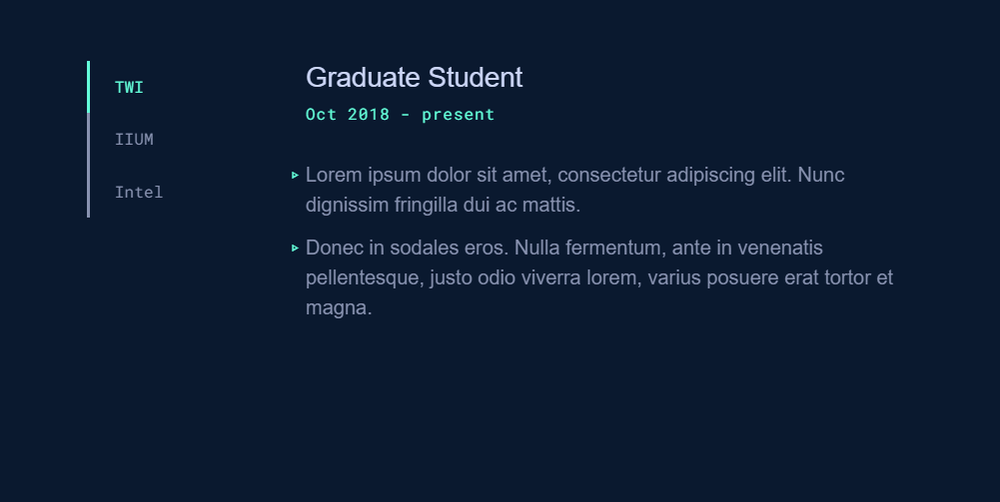

# react-vertical-tab
Created with CodeSandbox

This is a self-practice on creating a vertical tab for create-react-app. Component was created without the dependency of react-transition-group. This component should contribute to my personal website (under development).

Example of use cases:
  * Work experience/academic qualification in a portfolio website.
  * Categorical contents, i.e. showing appropriate content according to categories.

Design is inspired by [brittanychiang.com](https://brittanychiang.com/) in the Career/Work section. Codes were created without copy-pasting Brittany's codes.

## Demo
You can find the demo in codesandbox here: [codesandbox](https://codesandbox.io/s/summer-thunder-01k9y)



## Installation
```
$ git clone https://github.com/farisnafiah/react-vertical-tab
.git
$ cd project
$ npm install
```

## Run the application for development
```
$ npm start
```

## Language and tools
* React
* CSS
